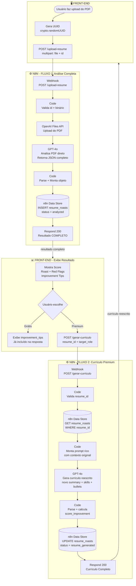
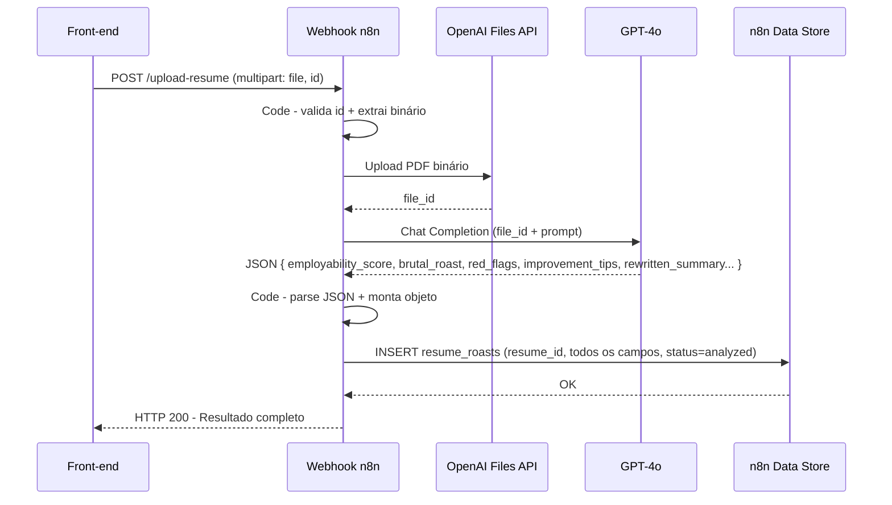
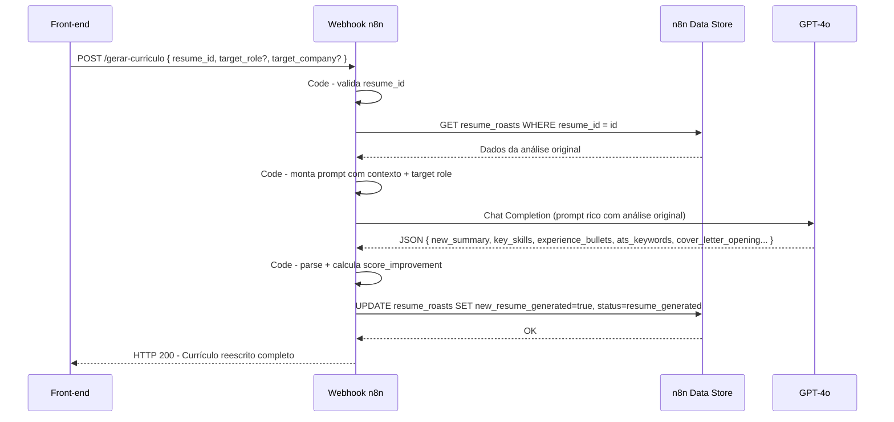

# Resume Roast - Fluxograma

## Visão Geral do Sistema



---

## Fluxo 1 — Sequência Detalhada



---

## Fluxo 2 — Sequência Detalhada



---

## Tabela interna n8n: `resume_roasts`

### Campos criados pelo Fluxo 1

| Campo | Tipo | Descrição |
|---|---|---|
| `resume_id` | String | UUID gerado no front-end (chave de busca) |
| `employability_score` | Number | Score 0-100 |
| `ats_rejection_chance` | Number | % de rejeição por ATS |
| `hook_message` | String | Frase do maior problema encontrado |
| `brutal_roast` | String | Parágrafo de crítica |
| `red_flags` | JSON String | Array de 3 clichês/problemas |
| `improvement_tips` | JSON String | Array de 5 dicas acionáveis |
| `rewritten_summary` | String | Summary otimizado |
| `status` | String | `analyzed` |
| `created_at` | String | ISO timestamp |

### Campos adicionados pelo Fluxo 2

| Campo | Tipo | Descrição |
|---|---|---|
| `new_resume_generated` | Boolean | `true` quando o Fluxo 2 rodar |
| `new_summary` | String | Novo summary gerado |
| `key_skills` | JSON String | Array de 10-15 skills |
| `experience_bullets` | JSON String | Array de bullets STAR com números |
| `ats_keywords` | JSON String | Array de 15 keywords para ATS |
| `final_score_prediction` | Number | Score previsto após melhorias |
| `cover_letter_opening` | String | Abertura da cover letter |
| `status` | String | `resume_generated` |

---

## JSON de Resposta por Endpoint

### `POST /upload-resume` → Resposta

```json
{
  "resume_id": "550e8400-e29b-41d4-a716-446655440000",
  "employability_score": 34,
  "ats_rejection_chance": 91,
  "hook_message": "Your resume has a formatting issue that causes automatic rejection by 9 out of 10 ATS systems.",
  "brutal_roast": "This resume reads like it was written by someone who Googled 'resume template 2009' and never looked back...",
  "red_flags": ["results-driven", "team player", "passionate about synergy"],
  "improvement_tips": [
    "Replace buzzwords with specific achievements and numbers",
    "Add a measurable impact to every bullet point",
    "Remove the Objective section and replace with a strong Summary",
    "List your tech stack in a dedicated Skills section",
    "Use reverse chronological order consistently"
  ],
  "rewritten_summary": "Senior Software Engineer with 6+ years building scalable APIs and distributed systems..."
}
```

### `POST /gerar-curriculo` → Resposta

```json
{
  "resume_id": "550e8400-e29b-41d4-a716-446655440000",
  "original_score": 34,
  "final_score_prediction": 87,
  "score_improvement": 53,
  "new_summary": "Senior Backend Engineer with 6+ years building high-performance REST APIs...",
  "key_skills": ["Node.js", "TypeScript", "PostgreSQL", "Docker", "AWS", "Redis", "..."],
  "experience_bullets": [
    "Reduced API response time by 40% by implementing Redis caching layer",
    "Led migration of monolith to microservices serving 50k+ daily users",
    "..."
  ],
  "certifications_suggestions": ["AWS Solutions Architect", "CKA - Kubernetes", "MongoDB Developer"],
  "ats_keywords": ["REST API", "microservices", "CI/CD", "Docker", "Kubernetes", "..."],
  "cover_letter_opening": "With 6+ years architecting backend systems that have scaled to handle millions of requests...",
  "generated_at": "2026-03-19T22:21:00.000Z"
}
```
