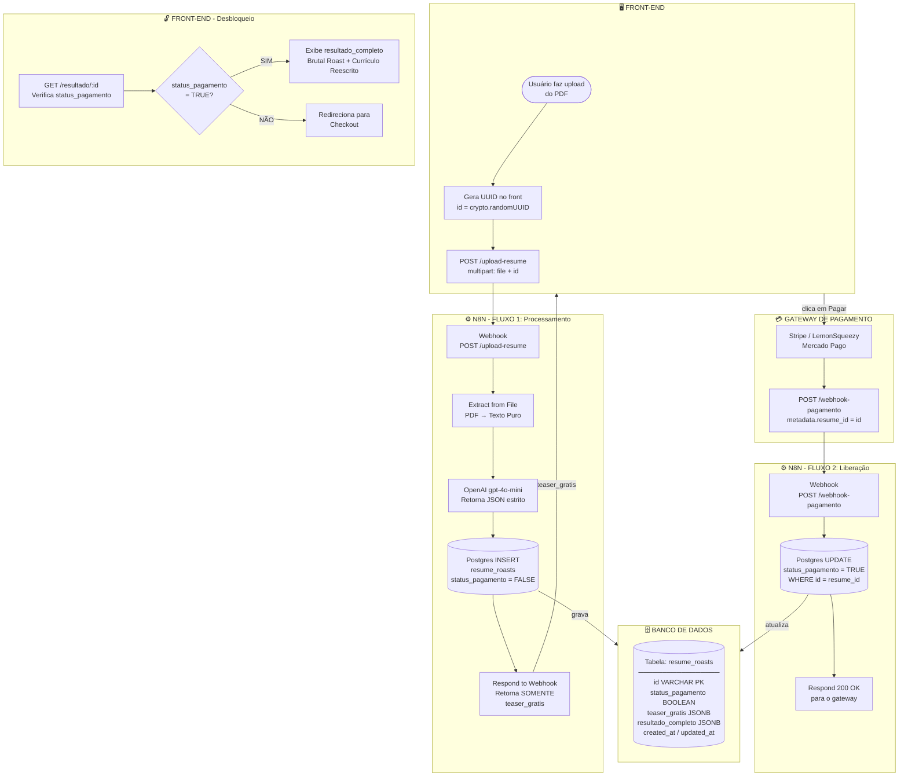
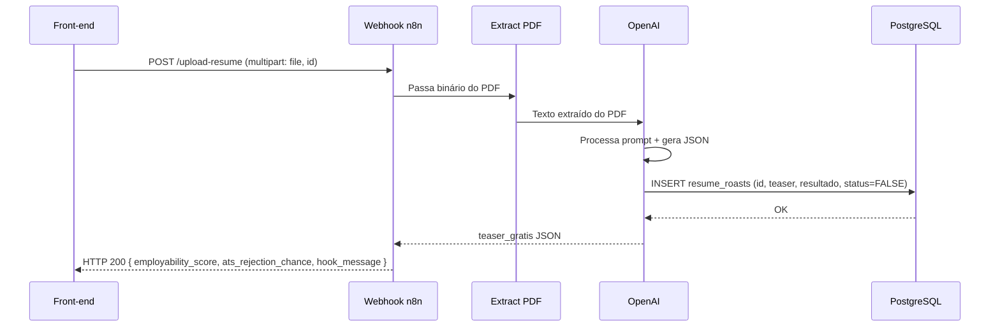
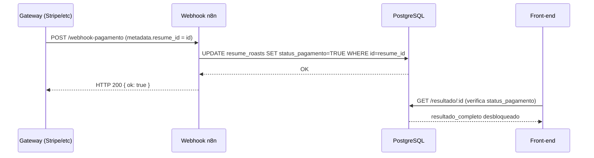
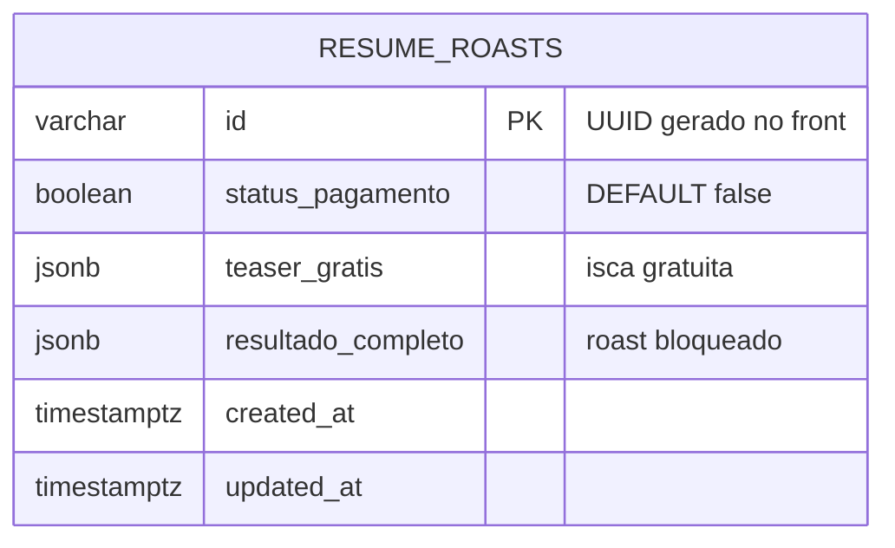

# Resume Roast - Fluxograma do Back-end

## Visão Geral



---

## Fluxo 1 — Detalhado



---

## Fluxo 2 — Detalhado



---

## Estrutura do Banco



---

## JSON esperado da IA

### `teaser_gratis`
```json
{
  "employability_score": "34/100",
  "ats_rejection_chance": "91%",
  "hook_message": "There is a catastrophic error in your resume that guarantees automatic rejection by 9 out of 10 ATS systems."
}
```

### `resultado_completo`
```json
{
  "brutal_roast": "Your resume looks like it was written by someone who Googled 'how to write a resume' in 2009 and never looked back...",
  "red_flags": ["results-driven", "team player", "synergy"],
  "rewritten_summary": "Senior Software Engineer with 6+ years building scalable distributed systems..."
}
```

---

## Metadados por Gateway

| Gateway | Campo no payload | Path no n8n |
|---|---|---|
| **Stripe** | `metadata.resume_id` | `$json.body.data.object.metadata.resume_id` |
| **LemonSqueezy** | `custom_data.resume_id` | `$json.body.meta.custom_data.resume_id` |
| **Mercado Pago** | `external_reference` | `$json.body.external_reference` |
